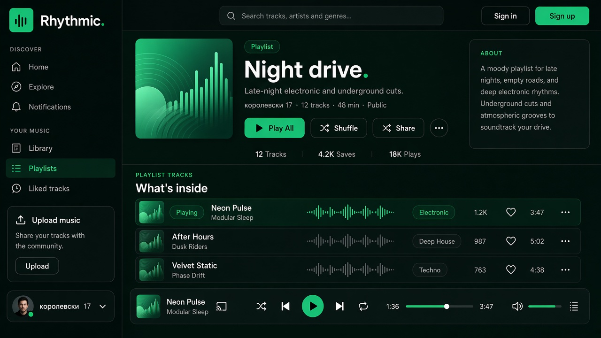

# Макет страницы плейлиста

Опирается на уже сделанные главную и профиль: фон `#070a08`, сайдбар `#090c0a`, акцент `#34d399`, шрифт Inter, скругления `xl/2xl`, нижний плеер без изменений.

## Каркас

Тот же шелл, что у Home / Profile:

- левый сайдбар 250px, в `Your music` активен пункт **Playlists**
- sticky-хедер с поиском, Sign in / Sign up
- `main` со сдвигом `lg:ml-[250px]` и отступом снизу под плеер
- нижний плеер на всю ширину справа от сайдбара

## Hero

Как шапка профиля, но вместо аватара — квадратная обложка плейлиста (`rounded-2xl`, градиент emerald→teal, те же «виниловые» круги и эквалайзер).

- бейдж `Playlist` (как `Artist` на профиле)
- заголовок крупный, точка у названия изумрудная: `Night drive.`
- короткое описание (zinc-500)
- мета: владелец · число треков · длительность · Public / Private
- кнопки: **Play all** (изумрудная, как Start listening), **Shuffle** / **Share** (outline), ⋯
- статистика под разделителем: Tracks / Saves / Plays

## Список треков

Повторяет ряды с главной (`TrackRow`): обложка, название, Playing-бейдж, waveform, жанр, plays, like, ⋯.

Слева номер `01`, `02`… как на профиле. Активный трек — extra-бледный emerald фон и бордер.

Справа карточка **About the playlist** в том же стиле, что «About the artist».

## Состояния

- пустой плейлист: тот же hero, вместо списка текст + CTA «Add tracks»
- свой плейлист: дополнительно Edit / Delete (outline, без новых цветов)
- чужой: Save (изумрудный ghost, как Follow)

Это только макет. Реализацию в `src/` не трогать.
